# 📊 Diagramme de Gestion des Dates

## 🔄 Cycle Hebdomadaire Complet


## 📅 Timeline Détaillée


## 🎯 Scénarios de Commande

```mermaid
graph TD
    A[Client veut commander] --> B{Quel jour?}

    B -->|Mercredi| C[Semaine en cours]
    B -->|Jeudi-Vendredi| D[Semaine en cours]
    B -->|Samedi-Dimanche| E[Semaine en cours]
    B -->|Lundi-Mardi| F[Semaine en cours]

    C --> C1[Nouveaux paniers disponibles]
    C1 --> C2[Commande pour mercredi-mardi]
    C2 --> C3[Livraison selon planning]

    D --> D1[Paniers de la semaine]
    D1 --> D2[Commande pour mercredi-mardi]
    D2 --> D3[Livraison selon planning]

    E --> E1[Paniers de la semaine]
    E1 --> E2[Commande pour mercredi-mardi]
    E2 --> E3[Livraison selon planning]

    F --> F1[Paniers de la semaine]
    F1 --> F2[Commande pour mercredi-mardi]
    F2 --> F3[Livraison selon planning]

    F3 --> G{Commande en retard?}
    G -->|Oui| H[Reportée semaine suivante]
    G -->|Non| I[Livraison confirmée]

    H --> J[Message: "Commande pour la semaine suivante"]
    I --> K[Confirmation de livraison]
```

## 🔄 Transition Semaine N → Semaine N+1

```mermaid
sequenceDiagram
    participant C as Client
    participant S as Système
    participant P as Paniers
    participant L as Livraisons

    Note over C,L: Mardi 23h59 - Fin de la semaine N

    C->>S: Commande en retard
    S->>C: "Délai dépassé, reporté semaine suivante"

    Note over C,L: Mercredi 00h00 - Début semaine N+1

    S->>P: Mise à jour compositions
    P->>S: Nouveaux paniers disponibles
    S->>C: "Nouveaux paniers disponibles"

    C->>S: Commande pour semaine N+1
    S->>L: Planification livraison
    L->>C: Confirmation livraison

    Note over C,L: Cycle recommence
```



## 📊 États des Paniers par Jour


## 🎯 Gestion des Abonnements


## 📱 Interface Utilisateur - États

```mermaid
graph TD
    subgraph "Affichage des Dates"
        A[Header de page] --> B["📅 Semaine du 15/01 au 21/01"]
        A --> C["🕐 Nouveaux paniers mercredi"]
    end

    subgraph "Cartes Produits"
        D[ProductCard] --> E["🥬 Panier SOLO - 12€"]
        D --> F["📅 Disponible 15/01-21/01"]
        D --> G["⏰ Commande jusqu'à mardi 15h"]
    end

    subgraph "Checkout"
        H[CheckoutForm] --> I["📦 Commande semaine 15/01-21/01"]
        H --> J["📍 Livraison prévue mardi 16h"]
        H --> K["✅ Confirmation"]
    end
```



## 🔧 Logique Technique

```mermaid
graph TD
    A[Date actuelle] --> B{Calcul jour de semaine}

    B -->|0-2| C[Dimanche-Lundi-Mardi]
    B -->|3-6| D[Mercredi-Samedi]

    C --> E[Semaine précédente]
    D --> F[Semaine en cours]

    E --> G[Période: Mercredi précédent → Mardi]
    F --> H[Période: Mercredi → Mardi suivant]

    G --> I[Composition fixée]
    H --> J[Composition actuelle]

    I --> K[Message: "Paniers de la semaine"]
    J --> L[Message: "Nouveaux paniers disponibles"]
```

## 📊 Métriques de Gestion

```mermaid
pie title Répartition des Commandes par Jour
    "Mercredi" : 25
    "Jeudi" : 20
    "Vendredi" : 15
    "Samedi" : 10
    "Lundi" : 15
    "Mardi" : 10
    "Dimanche" : 5
```



---

_Diagrammes créés avec Mermaid - Décembre 2024_
