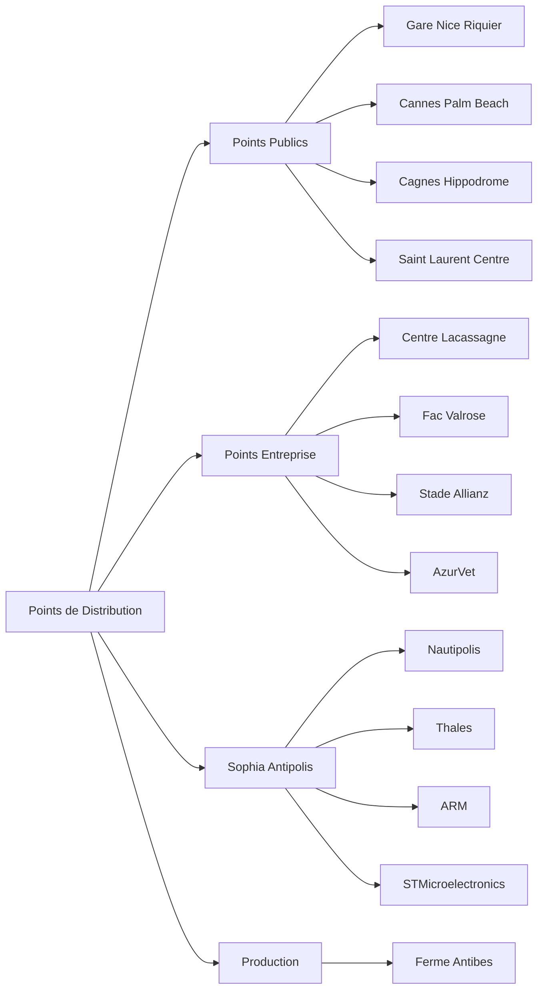
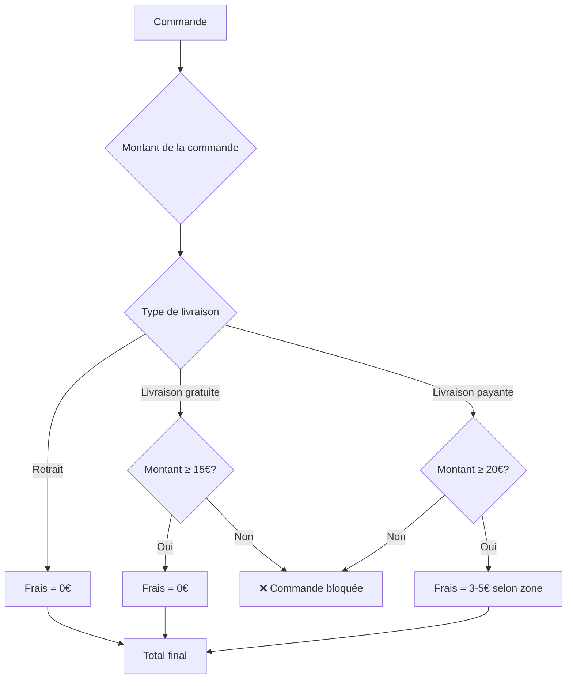
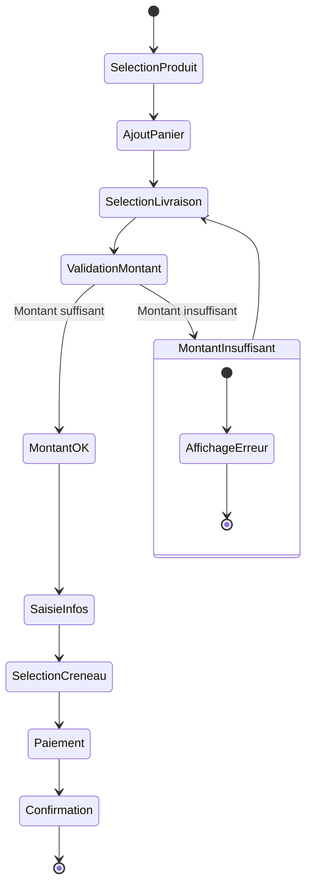
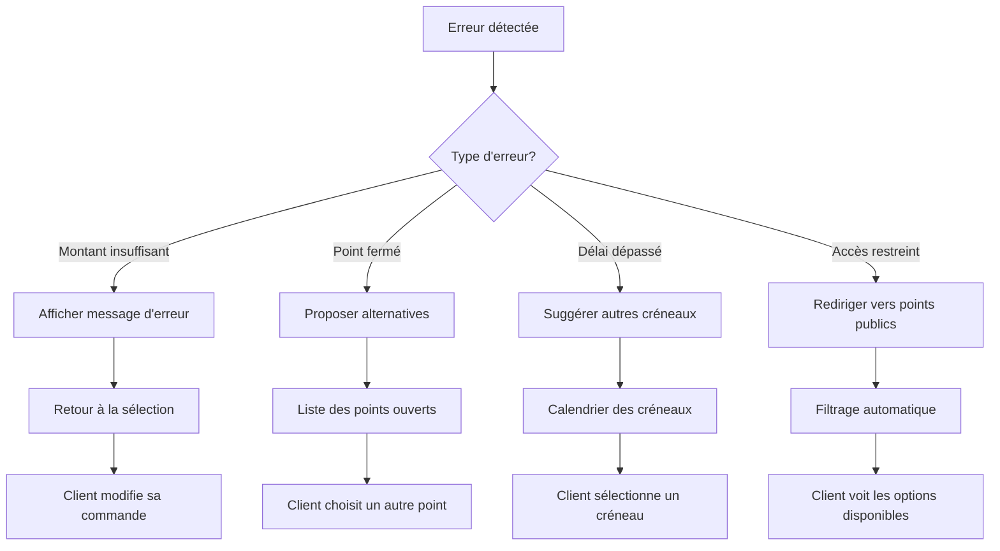
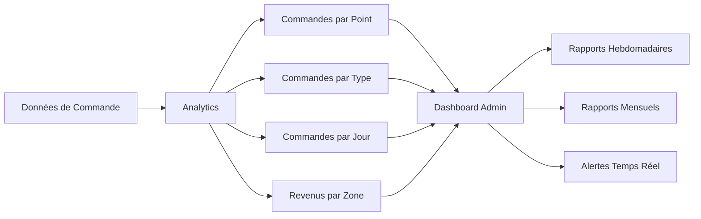

# 📊 Diagrammes de Gestion des Livraisons

## 🛒 Flux de Commande

```mermaid
graph TD
    A[Client visite le site] --> B[Parcourt les produits]
    B --> C[Clique "Ajouter au panier"]
    C --> D[Produit ajouté au panier]
    D --> E[Clique "Commander maintenant"]
    E --> F[Ouverture du checkout]
    F --> G[Sélection du point de distribution]
    G --> H[Vérification du cycle hebdomadaire]
    H --> I{Type de livraison?}

    I -->|Retrait| J[Point de retrait]
    I -->|Livraison gratuite| K[Vérification montant ≥ 15€]
    I -->|Livraison payante| L[Vérification montant ≥ 20€]

    J --> M[Saisie informations personnelles]
    K --> N{Montant OK?}
    L --> O{Montant OK?}

    M -->|Oui| L
    M -->|Non| O[Erreur: Montant insuffisant]
    N -->|Oui| P[Calcul frais de livraison]
    N -->|Non| O

    P --> L
    L --> Q[Sélection date et créneau]
    Q --> R[Choix mode de paiement]
    R --> S[Confirmation commande]
    S --> T[Email de confirmation]
    T --> U[Préparation commande]
    U --> V[Livraison/Retrait]
```

## 🏢 Architecture des Points de Distribution



## 💰 Calcul des Frais



## ⏰ Planning Hebdomadaire

```mermaid
gantt
    title Planning des Distributions
    dateFormat  HH:mm
    axisFormat %H:%M

    section Lundi
    Cannes Palm Beach    :done, lundi1, 11:00, 14:00
    Mouans Sartoux      :done, lundi2, 11:00, 12:00
    Livraison Antibes   :done, lundi3, 14:00, 19:00

    section Mardi
    Nice Riquier        :done, mardi1, 16:00, 19:00
    Cagnes Hippodrome   :done, mardi2, 10:20, 10:30
    Saint Laurent       :done, mardi3, 10:40, 11:20
    Livraison Antibes   :done, mardi4, 14:00, 19:00

    section Mercredi
    Livraison Antibes   :done, mercredi1, 14:00, 19:00

    section Jeudi
    Nice Riquier        :done, jeudi1, 16:00, 19:00

    section Vendredi
    Sophia Antipolis    :done, vendredi1, 10:30, 16:30
    Livraison Antibes   :done, vendredi2, 14:00, 19:00

    section Samedi
    Livraison Antibes   :done, samedi1, 09:00, 14:00
```



## 🔄 Processus de Validation



## 📱 Interface Utilisateur

```mermaid
graph TB
    A[Page d'accueil] --> B[Section Produits Phares]
    B --> C[Cartes Produits]
    C --> D[Bouton "Ajouter au panier"]
    D --> E[Panier Sidebar]
    E --> F[Bouton "Commander maintenant"]
    F --> G[Modal Checkout]

    G --> H[Sélecteur de Points]
    H --> I[Liste des Points]
    I --> J[Filtres par Type]
    J --> K[Recherche par Ville]
    K --> L[Sélection du Point]
    L --> M[Validation]
    M --> N[Formulaire Client]
    N --> O[Paiement]
    O --> P[Confirmation]
```

## 🚨 Gestion des Erreurs



## 📊 Métriques et Suivi



---

_Ces diagrammes peuvent être visualisés avec un outil supportant Mermaid comme GitHub, GitLab, ou des éditeurs comme VS Code avec l'extension Mermaid._
