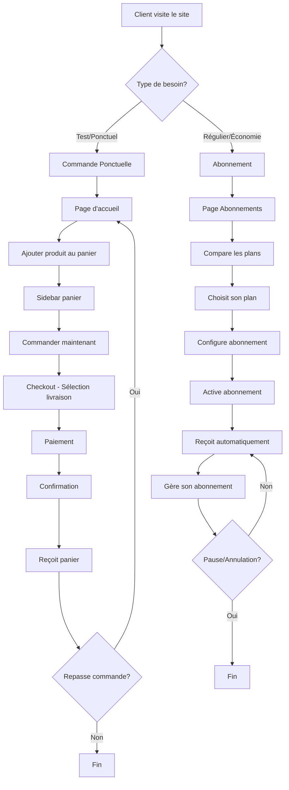
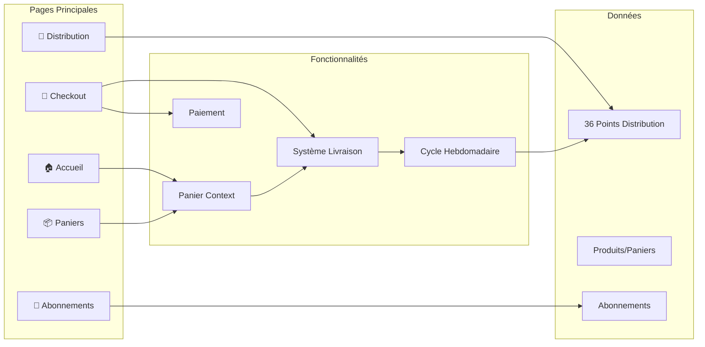
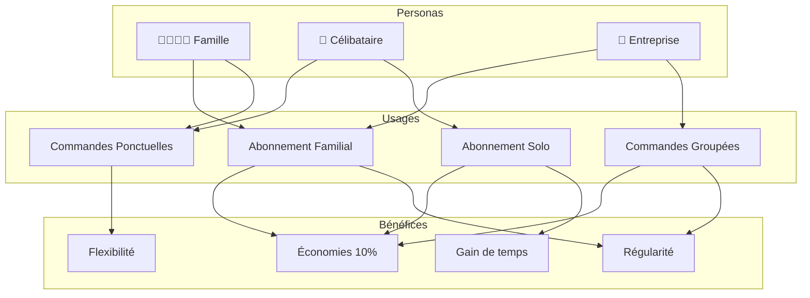
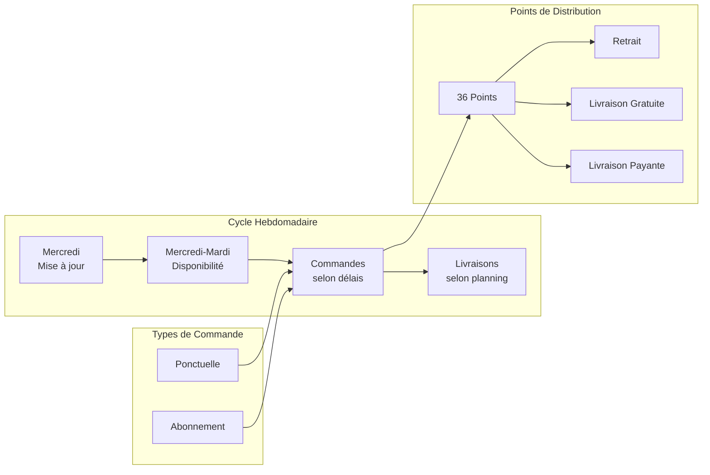
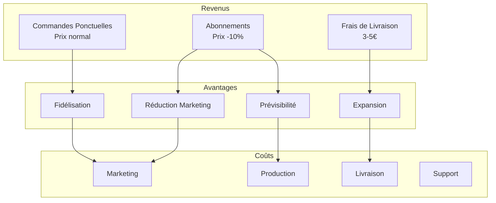
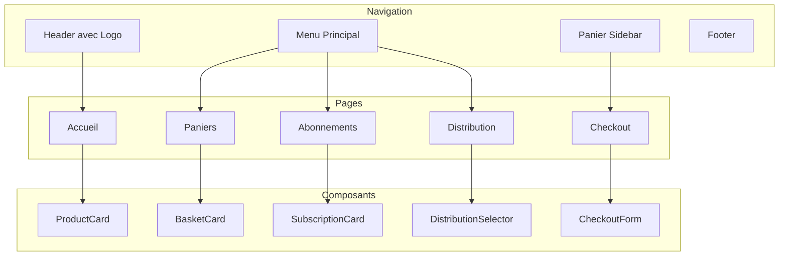
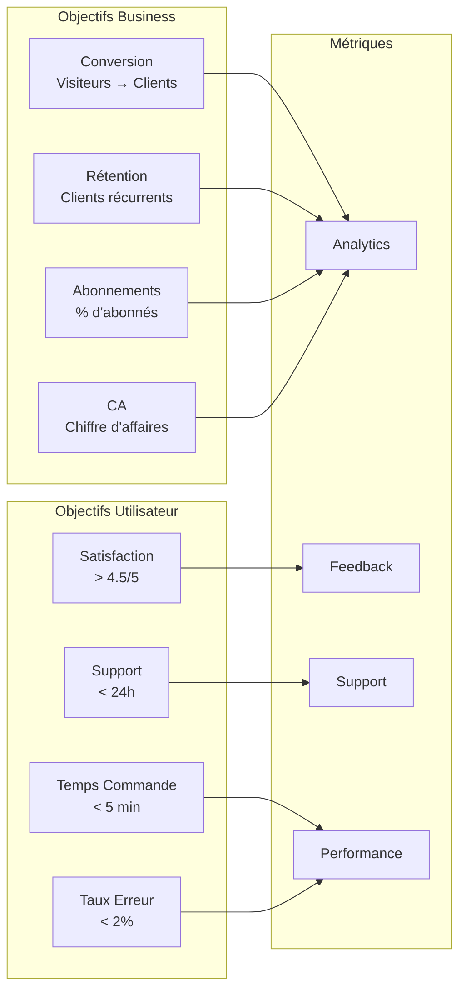

# 📊 Diagramme des Usages - MVP Panier des Producteurs

## 🎯 Parcours Utilisateur Principal

## 🏗️ Architecture Fonctionnelle

## 🎭 Personas et Usages

## 🔄 Cycle de Vie des Commandes

## 💰 Modèle Économique

## 📱 Interface Utilisateur

## 🎯 Objectifs et Métriques

---

_Diagrammes créés avec Mermaid - Octobre 2025_
